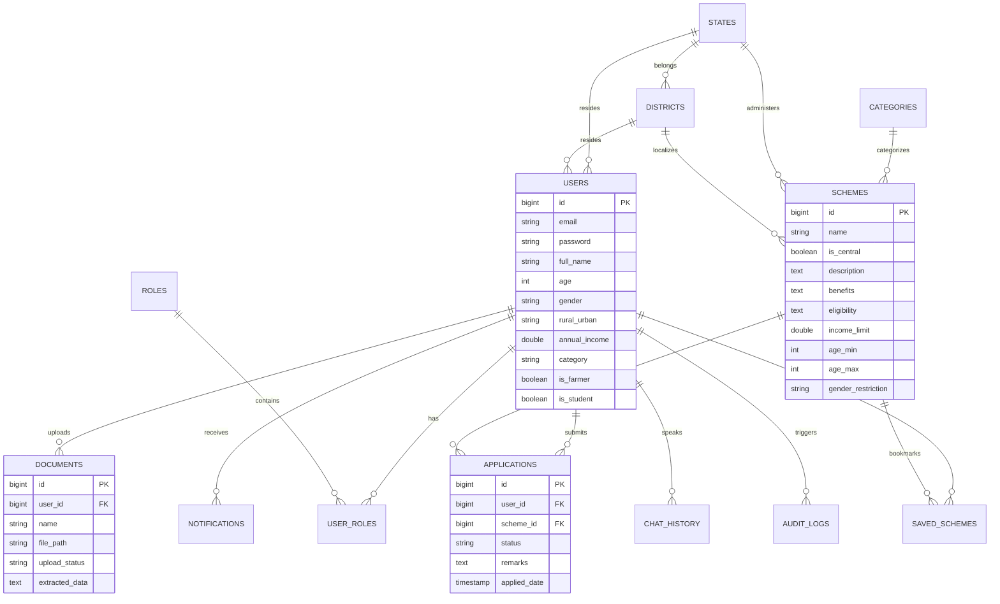

# SchemeSathi AI – India's Intelligent Digital Welfare Assistant

**SchemeSathi AI** is a production-ready, full-stack, AI-powered welfare recommendation platform designed to help Indian citizens discover, qualify for, and secure Central & State welfare benefits. Using demographic matching rules, real-time multilingual AI chat support, document verification via optical extraction (OCR), and visual progress tracking, SchemeSathi makes digital inclusion simple and accessible.

---

## 🛠 Tech Stack

### Backend
- **Java 21 & Spring Boot 3.3.1**
- **Spring Security** (Stateless JWT Authentication, BCrypt encodings)
- **Spring Data JPA** (Hibernate ORM, connection poolings)
- **MySQL 8.0**
- **Spring AI with Google Gemini 1.5 Flash** (For intelligent recommendations, chatbot conversations)
- **Apache PDFBox** (Document text extraction)

### Frontend
- **React 18 & Vite**
- **Tailwind CSS** (Premium glassmorphic layers, custom scrollbars, transitions)
- **React Router & React Hook Form**
- **Axios** (API HTTP interceptors with auto-JWT headers injection)
- **Recharts** (Visual analytics for administrators)
- **Lucide Icons**

---

## 📊 Database ER Diagram

The schema consists of 13 normalized tables. Here is the relational mapping:



---

## 🚀 Local Development Setup

### Prerequisites
- **Java JDK 21**
- **Node.js v20+**
- **MySQL Server 8.0**
- **Google AI Studio Key (Gemini API Key)** (Optional; runs in intelligent fallback mode if not provided)

---

### Step 1: Database Setup
1. Log in to your MySQL terminal:
   ```sql
   CREATE DATABASE schemesathi;
   ```
2. The schema DDL script is located in `backend/src/main/resources/schema.sql`.
3. Initial seed data (roles, states, districts, and 10+ real schemes) is in `backend/src/main/resources/data.sql`. These run automatically on Spring Boot launch if configured under Spring SQL scripts, or you can run them manually.

---

### Step 2: Running Backend
1. Open a terminal in `backend/` directory.
2. Edit `src/main/resources/application.yml` or set environment variables:
   ```bash
   export GEMINI_API_KEY="your-gemini-api-key"
   ```
3. Run the Spring Boot application:
   ```bash
   mvn clean compile spring-boot:run
   ```
   The backend will bootstrap on `http://localhost:8080`.

---

### Step 3: Running Frontend
1. Open a terminal in `frontend/` directory.
2. Install npm packages:
   ```bash
   npm install
   ```
3. Run Vite dev server:
   ```bash
   npm run dev
   ```
   Open `http://localhost:5173` to interact with the platform.

---

## 🐳 Docker Deployment (Production Ready)

To boot up the entire stack (React, Spring Boot, MySQL, and Nginx reverse proxy) in a single command:

1. In the root directory, create a `.env` file containing your Gemini key:
   ```env
   GEMINI_API_KEY=your_gemini_api_key_here
   ```
2. Build and launch docker orchestration services:
   ```bash
   docker-compose up --build
   ```
3. The services will configure:
   - **Frontend SPA (via Nginx)**: `http://localhost:3000`
   - **Spring Boot Backend REST APIs**: `http://localhost:8080`
   - **MySQL database (with persistent volume link)**: `http://localhost:3306`

---

## 🔐 Credentials for Testing

Three user accounts can be created or login with these credentials (seed them in your db or register):
- **Citizen Account**: Register on UI.
- **Admin Account**: Set `user_roles` with `ROLE_ADMIN` (id: 2) inside database. Enables scheme creation catalog tools, Recharts analytics spreads, and advanced applications approval dashboard.
